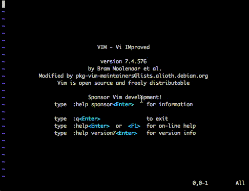

# gcc-jump
C code browser implemented with gcc-plugin, used as vim-plugin. With gcc's help, we can build a very precise jump table with, for example, conditional macros considered. I use this to read source code of glibc, valgrind and linux-kernel (in user mode).

## quick start

Suppose the gcc-jump is cloned to `$GCJ_ROOT/gcc-jump`. We are going to build a gcc with our patch and build the plugin to work with the gcc.

1. download gcc source code

```sh
cd $GCJ_ROOT
git clone https://github.com/gcc-mirror/gcc.git
```

2. checkout gcc-6_3_0-release

```sh
cd gcc/
git checkout gcc-6_3_0-release
```

3. patch with `gcc-jump/gcc/gcc-6_3_0-release.gcc-jump.patch`

```sh
git apply $GCJ_ROOT/gcc-jump/gcc/gcc-6_3_0-release.gcc-jump.patch
```

4. build and install gcc

```sh
mkdir $GCJ_ROOT/gcc-obj
cd $GCJ_ROOT/gcc-obj/
../gcc/configure --prefix=$GCJ_ROOT/gcc-local
make
make install
```

5. build gcc-jump

```sh
cd $GCJ_ROOT/gcc-jump/src/
INSTALLDIR=$GCJ_ROOT/gcc-local make
```

6. compile with gcc-jump plugin

```sh
GCJ_PLUGIN=$GCJ_ROOT/gcc-jump/src/gcj.so
GCJ_DATA=$GCJ_ROOT/data
GCJ_SH=$GCJ_ROOT/gcc-jump/test/gcj.sh
cat <<EOF >$GCJ_SH
#!/bin/bash

mkdir -p $GCJ_DATA/db
mkdir -p $GCJ_DATA/db/units

$GCJ_ROOT/gcc-local/bin/gcc -disable-line-directive -fplugin=$GCJ_PLUGIN -fplugin-arg-gcj-db=$GCJ_DATA/db "\$@"
EOF
chmod a+x $GCJ_SH

cd $GCJ_ROOT/gcc-jump/test/
aclocal
autoconf
automake --add-missing
./configure CC=$GCJ_SH
make
```
`make -j` is not currently supported.

7. browse the code with vim

```sh
GCJ_BIN=$GCJ_ROOT/gcc-jump/src/gcj GCJ_DATA=$GCJ_ROOT/data vim -c "source $GCJ_ROOT/gcc-jump/src/gcj.vim"
```
```
:GcjObj example
```
Use `:GcjObj $binary` to list all source files for the `$binary`. Cross-file linkage is processed at the first time calling this command, and this can be slow for large binaries. Currently only binaries in elf format are supported.

Use `:GcjObj` to list all source files in the database.

Press `<Leader>j` on a variable/structure/macro/include to jump to its declaration/definition/source.

Press `<Leader>e` on a macro to expand. You may further jump on the expanded token to its declaration place.

Press `<Leader>r` to list the jump history in a new buffer. You may edit and save as reading notes.

Use `:GcjClear` to clear the jump history.


